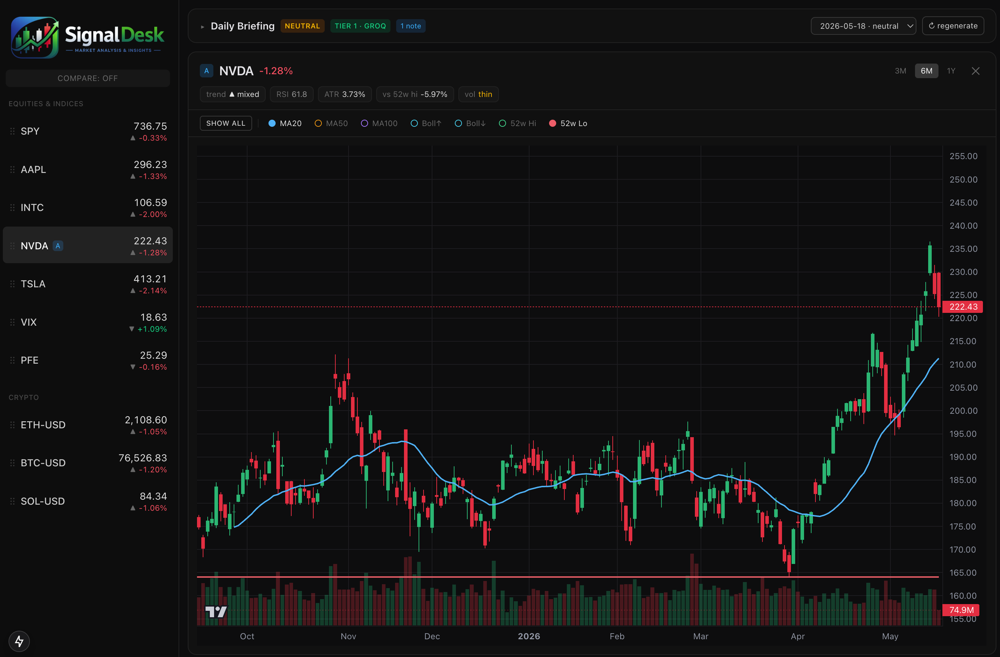
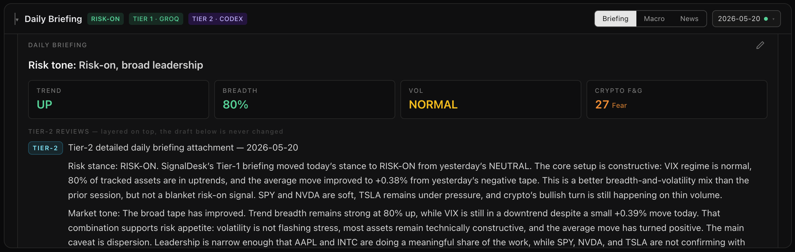
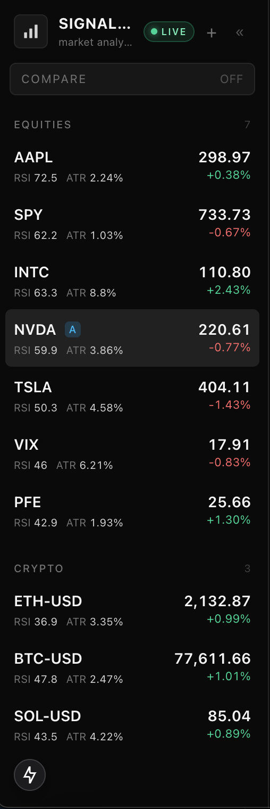
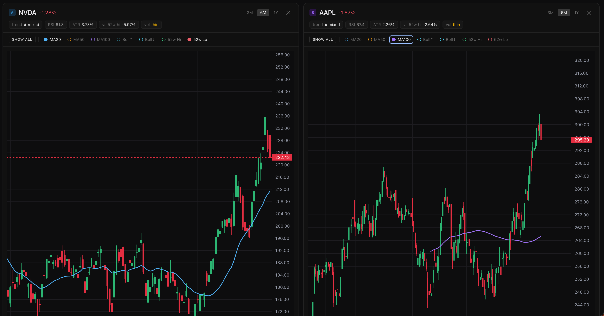
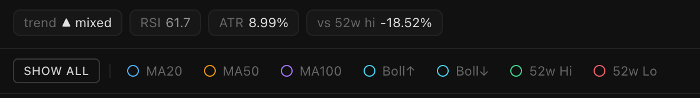
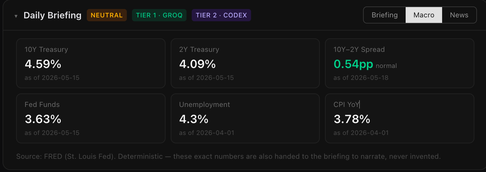
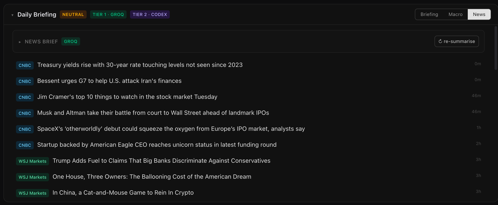

# SignalDesk Local

A **private, local-first, AI-powered market research & trading-journal
dashboard**. Runs entirely on your laptop via Docker. No broker, no live
trading, no paid infrastructure, no multi-user accounts — a personal research
tool that blends TradingView-style charts, a Notion-like reading view, a
simplified Bloomberg-terminal feel, and an AI research assistant.

> Not a SaaS product, not a platform, not a trading-execution system.

## Screenshots

| Dashboard (charts + signals) | Daily briefing + provenance |
|---|---|
|  |  |

| Watchlist (grouped, drag-reorder) | Compare view (2 charts) |
|---|---|
|  |  |

| Signals (overlays + legend toggles) | Macro tab (FRED, deterministic) |
|---|---|
|  |  |

| News tab (RSS + descriptive brief) | |
|---|---|
|  | |

## The idea: a 3-tier "brain"

A reviewer pipeline, not parallel opinions — each tier has a distinct job and
**everything is provenance-stamped** so you always know who said what:

```
Tier 0 — Signals (pure Python, deterministic)
   trend / RSI / ATR / Bollinger / 52w / volume / VIX regime / flags
   → can't hallucinate, always works, the trustworthy floor
        │
Tier 1 — Auto-draft (free LLM, scheduled 10:30 ET, push)
   segmented daily briefing + per-asset notes; deterministic risk-on/off
   call the model EXPLAINS (never decides); templated fallback if no key
        │
Tier 2 — Deep review (strong model via MCP, on demand, pull)
   Claude / Codex read the real local data and ANNOTATE the draft
   (append-only — the Tier-1 draft is never overwritten)
```

The AI **narrates deterministic facts**; it never invents numbers or prices.
Conclusions (the risk call, the "signals to watch" list) are *computed*, not
the model's opinion.

## Features (built)

- **Dashboard shell** — persistent watchlist rail + 1–2 chart workspace,
  selection in the URL (bookmarkable), single-screen feel.
- **Watchlist** — grouped (Equities & Indices / Crypto), drag-to-reorder,
  live price + % change + trend per row.
- **Charts** — TradingView lightweight-charts candlesticks + volume, with
  toggleable overlays (MA20/50/100, Bollinger, 52w hi/lo) via a clickable
  legend (per-signal + master on/off), 3M/6M/1Y ranges, compare 2 assets.
- **Tier-0 signals** — pure deterministic engine; trend, %, RSI, ATR,
  52-week distance, volume flags, VIX regime.
- **Tier-1 briefing** — automatic daily digest segmented by asset class,
  deterministic risk-on/off call, "signals to watch", day-over-day deltas;
  free-LLM provider chain (Groq → OpenRouter → templated fallback);
  scheduled by a dedicated cron container; provenance-badged in the UI.
- **Archive** — browse past briefings by date; Tier-2 annotations layered
  beneath the draft with their own provenance badges.
- **MCP server** — one client-agnostic stdio server (Claude Desktop /
  Claude CLI / Codex); the strong model reads local data and writes **one
  consolidated Tier-2 annotation** onto the daily briefing (the single
  Tier-2 surface), attributed per client.
- **Desk dock** — a trading journal (real / paper / observation) with
  thesis-now / lesson-on-close and **computed** P/L (never typed), plus
  Notion-like markdown notes (pin, per-asset). Bottom dock mirrors the
  briefing bar: the desk speaks at the top, you write back at the bottom.
- **Macro & News** — the top dock is a 3-tab desk: **Briefing | Macro |
  News**. Macro = deterministic FRED series (yields, curve, Fed funds,
  unemployment, CPI YoY) — the same numbers are handed to the briefing to
  *narrate* (never invent). News = free RSS headlines (CNBC / WSJ / Fed)
  with an on-demand, descriptive LLM brief that is deliberately walled off
  from the deterministic risk stance.

## Tech stack

Next.js + TypeScript + TailwindCSS · TradingView lightweight-charts ·
FastAPI · SQLite (WAL) · Python MCP server · Docker Compose ·
yfinance (equities/index) + Binance public REST (crypto) · free/OSS only.

API on **:8081**, frontend on **:3000**.

## Quick start

Requires **Docker Desktop running** (provides the Linux VM on macOS).

```bash
cp .env.example .env        # optional: add a free GROQ_API_KEY for real AI
docker compose up --build
```

- Dashboard: <http://localhost:3000>
- API + docs: <http://localhost:8081/docs>

Without an LLM key everything still works — the briefing uses its
deterministic templated fallback. Add a free Groq key to `.env` for real AI
briefings (the cron + the ↻ regenerate button use it). A free
`FRED_API_KEY` (fred.stlouisfed.org) enables the Macro tab; everything
degrades gracefully without it.

### Run modes

- **Dev (default)** — `docker compose up --build`. Turbopack + hot reload;
  edit a file and it updates live.
- **Prod (opt-in, fast)** — precompiled, ~50–150ms page loads, **no** hot
  reload. Use when you just want to *use* the app:

  ```bash
  docker compose -f docker-compose.yml -f docker-compose.prod.yml up --build
  ```

  (Needs Docker Compose ≥ 2.24 for the `!override` volume tag.)

## Connect the AI (Tier 2)

See **[`mcp/README.md`](mcp/README.md)** for one-time setup of Claude
Desktop, Claude CLI, and Codex. The server is identical for every client;
only each client's config differs (an `MCP_AGENT` env var stamps provenance).

## Architecture & design

Full design rationale and the phased build plan are in
**[`ARCHITECTURE.md`](ARCHITECTURE.md)**.

Key principle: **one source of truth (SQLite); the FastAPI backend is the
only process that opens it.** The dashboard, the cron, and the MCP server are
all just clients of that backend.

## Project layout

```
backend/    FastAPI app — data adapters, signal engine, briefing, cron
frontend/   Next.js dashboard (App Router)
mcp/        client-agnostic MCP server (Tier-2 bridge) + setup docs
data/       SQLite DB (gitignored — host-visible for GUI inspection)
ARCHITECTURE.md   design + phased plan
```

## Notes

- Local-first & single-user by design. `.env`, the SQLite DB, and
  `node_modules`/venvs are gitignored.
- Free equity data is delayed (~15 min); this is a research/journaling tool,
  not a real-time trading system.
